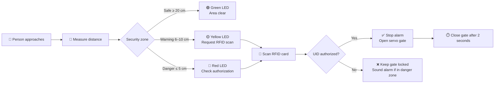

<div align="center">

# 🔐 Ultrasonic RFID Security Gate

### A real-time, Arduino-based access-control prototype

<p>
  
  
  
  
</p>

<p>
  <strong>Detect proximity.</strong>&nbsp; <strong>Authenticate identity.</strong>&nbsp; <strong>Control access.</strong>
</p>

<p>
  <a href="#-overview">Overview</a> •
  <a href="#-features">Features</a> •
  <a href="#-prototype-screenshots">Screenshots</a> •
  <a href="#-hardware">Hardware</a> •
  <a href="#-getting-started">Get Started</a> •
  <a href="#-project-structure">Project Structure</a>
</p>

</div>

---

## 📖 Overview

The **Ultrasonic RFID Security Gate** is a physical access-control system built around an Arduino-compatible Maker UNO. It combines distance sensing, RFID authentication, visual status indicators, an LCD, and a servo motor to create a small but complete security-gate workflow.

When someone approaches the gate, the HC-SR04 ultrasonic sensor classifies the distance into a zone. The LCD and LEDs provide immediate feedback, while the MFRC522 reader checks the presented card. Only a configured RFID UID can open the servo-controlled gate; an unauthorized person entering the danger zone triggers an audible warning.

> 🎓 Developed for the *Internet of Things: Concepts and Applications* module as a practical embedded-systems and physical-security prototype.

## 📸 Prototype Screenshots

The working prototype combines a cardboard gate enclosure, an ultrasonic distance sensor, an RFID reader, an LCD, status LEDs, and a servo-powered barrier.

<table>
  <tr>
    <td align="center" width="50%">
      
      <br>
      <em>Prototype overview with the LCD showing a safe area.</em>
    </td>
    <td align="center" width="50%">
      
      <br>
      <em>Side view showing the scan-your-card entrance and gate mechanism.</em>
    </td>
  </tr>
</table>

## ✨ Features

| | Capability | Description |
|---|---|---|
| 📡 | **Proximity detection** | Classifies the approach area as safe, warning, or danger using an HC-SR04. |
| 🪪 | **RFID authentication** | Compares scanned MFRC522 UIDs against the configured authorized UID. |
| 🚪 | **Automatic gate control** | Opens the servo gate after successful authentication and closes it automatically. |
| 💡 | **Traffic-light status** | Green, yellow, and red LEDs communicate the current security state at a glance. |
| 🖥️ | **LCD feedback** | Displays prompts, access decisions, gate state, distance, and system readiness. |
| 🔊 | **Unauthorized-entry alarm** | Activates a passive buzzer when an unauthorised person reaches the danger zone. |
| 🧾 | **Serial diagnostics** | Reports zone transitions, scanned UIDs, access decisions, and gate events at 9600 baud. |

## ⚙️ How It Works



### Zone logic

| Distance | State | System response |
|---:|---|---|
| `≤ 5 cm` | 🔴 **Danger** | Red LED; buzzer sounds unless access has been granted. |
| `6–10 cm` | 🟡 **Warning** | Yellow LED; LCD asks the user to scan a key card. |
| `11–19 cm` | ⚪ **Transition / no object** | Treated as a clear area and shown with the green indicator. |
| `≥ 20 cm` | 🟢 **Safe** | Green LED; no alarm or access action. |

## 🧰 Hardware

| Component | Quantity |
|---|:---:|
| Maker UNO / Arduino Uno-compatible board | 1 |
| HC-SR04 ultrasonic sensor | 1 |
| MFRC522 RFID reader | 1 |
| MIFARE RFID card or key fob | 1 |
| SG90 servo motor | 1 |
| Passive buzzer | 1 |
| Red, yellow, and green LEDs | 3 |
| 220 Ω resistors | 4 |
| 16×2 I2C LCD | 1 |
| Breadboard and jumper wires | 1 set |
| USB or 9 V power supply | 1 |

## 🔌 Wiring

> ⚠️ The MFRC522 is a **3.3 V device**. Connect it to the correct voltage and share a common ground with the controller.

| Arduino pin | Connection |
|---|---|
| `D2` | HC-SR04 `TRIG` |
| `D3` | HC-SR04 `ECHO` |
| `D4` | Red LED through a resistor |
| `D5` | Yellow LED through a resistor |
| `D6` | Green LED through a resistor |
| `D7` | Passive buzzer |
| `D8` | Servo signal |
| `D9` | MFRC522 `RST` |
| `D10` | MFRC522 `SDA / SS` |
| `D11` | MFRC522 `MOSI` |
| `D12` | MFRC522 `MISO` |
| `D13` | MFRC522 `SCK` |
| `A4` | LCD `SDA` |
| `A5` | LCD `SCL` |
| `5V / GND` | LCD, LEDs, buzzer, and servo power rails |
| `3.3V / GND` | MFRC522 power |

## 🚀 Getting Started

### Prerequisites

- [Arduino IDE](https://www.arduino.cc/en/software)
- Arduino Uno-compatible board and the components listed above
- USB data cable
- Arduino libraries:
  - `LiquidCrystal_I2C`
  - `MFRC522`
  - `SPI` *(included with the Arduino IDE)*
  - `Servo` *(included with the Arduino IDE)*

### Installation

1. **Clone or download this repository.**
   ```bash
   git clone https://github.com/your-username/Ultrasonic-RFID-Security-Gate-System-IOT.git
   ```
2. Open [`IOT_ASSIGMENT.ino`](./IOT_ASSIGMENT.ino) in the Arduino IDE.
3. Install `LiquidCrystal_I2C` and `MFRC522` from **Tools → Manage Libraries**.
4. Assemble the circuit using the wiring table above.
5. Replace `authorizedUID` in the sketch with the UID of your own test card.
6. Select the correct board and port under **Tools**, then click **Upload**.
7. Open **Serial Monitor** at **9600 baud** to inspect readings and access events.

### Finding an RFID UID

1. Upload the sketch and open the Serial Monitor.
2. Present a card to the MFRC522 reader.
3. Copy the printed value in the format `43 BA FC 0A`.
4. Set that value as `authorizedUID`, upload again, and test the gate.

> 🔒 Treat card UIDs as credentials. Do not publish real production UIDs in a public repository, and do not use this prototype as the sole security control for a high-risk facility.

## 📁 Project Structure

```text
.
├── IOT_ASSIGMENT.ino                 # Arduino firmware and control logic
├── README.md                          # Project documentation
└── TP073549  IoT Individual Assignment.docx
                                      # Supporting assignment document
```

## 🧪 Testing Checklist

- [ ] LCD starts with an access-control ready message.
- [ ] Green LED is active when the area is clear.
- [ ] Yellow LED prompts for a card in the warning zone.
- [ ] An authorized card opens the servo gate.
- [ ] The gate closes automatically after approximately two seconds.
- [ ] An invalid card keeps the gate closed and displays **Access Denied**.
- [ ] The buzzer activates for an unauthorized person in the danger zone.
- [ ] Serial Monitor reports state changes at `9600` baud.

## ⚠️ Limitations and Safety

- Ultrasonic readings may be affected by angled, soft, or irregular surfaces and environmental noise.
- MFRC522 has a short operating range and is not a secure, clone-resistant authentication system.
- The authorized UID is stored directly in firmware and should be considered a demonstration mechanism only.
- Servo motors can draw significant current; use a suitable supply and connect grounds correctly.
- The current implementation has no network connectivity, encrypted event logging, or remote monitoring.
- Test the moving gate carefully and keep fingers, wires, and loose objects clear of the servo mechanism.

## 🔭 Future Improvements

- Add encrypted credentials or a stronger access-control protocol.
- Add Wi-Fi connectivity for event logging and remote monitoring.
- Introduce a proper power supply and a physical emergency-stop control.
- Replace blocking delays with non-blocking state management for more responsive operation.
- Add multiple authorized users, access schedules, and persistent audit logs.
- Improve distance filtering with averaging or sensor-fusion techniques.

## 👤 Author

**Shady Ehab Assad Ibrahim**  
BSc (Hons) Computer Science — Cyber Security specialization

<div align="center">

### ⭐ If this project helped you, consider giving it a star!

Built with ❤️ for practical IoT security learning.

</div>
